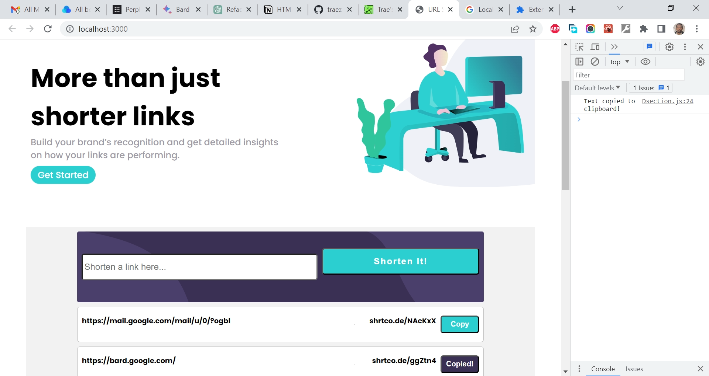

# Frontend Mentor - Shortly URL shortening API Challenge solution

This is a solution to the [Shortly URL shortening API Challenge challenge on Frontend Mentor](https://www.frontendmentor.io/challenges/url-shortening-api-landing-page-2ce3ob-G). Frontend Mentor challenges help you improve your coding skills by building realistic projects. 

## Table of contents

- [Overview](#overview)
  - [The challenge](#the-challenge)
  - [Screenshot](#screenshot)
  - [Links](#links)
- [My process](#my-process)
  - [Built with](#built-with)
  - [What I learned](#what-i-learned)
  - [Continued development](#continued-development)
  - [Useful resources](#useful-resources)
- [Author](#author)
- [Acknowledgments](#acknowledgments)

## Overview

### The challenge

Users should be able to:

- View the optimal layout for the site depending on their device's screen size
- Shorten any valid URL
- See a list of their shortened links, even after refreshing the browser
- Copy the shortened link to their clipboard in a single click
- Receive an error message when the `form` is submitted if:
  - The `input` field is empty

### Screenshot

### Links

- Solution URL: [https://github.com/traez/url-shortening-api-landing-page](https://github.com/traez/url-shortening-api-landing-page)
- Live Site URL: [https://url-shortening-api-landing-page-traez.vercel.app](https://url-shortening-api-landing-page-traez.vercel.app)

## My process

### Built with

- Semantic HTML5 markup
- CSS custom properties
- Flexbox
- CSS Grid
- Mobile-first workflow
- [React](https://reactjs.org/) - JS library
- [Next.js](https://nextjs.org/) - React framework

### What I learned

This project has limited end user functionality, so building it wasn't so exciting. Despite that, the build process was comparatively tasking at my current level. But I'm happy to have seen it through as it came with a lot of learnings. 

1. Learned methodology of building projects where the HTML is differently structured between the mobile and desktop view. Made me see how important and powerful React is, as against regular Vanilla JavaScript.
2. Learned about the existence of "custom React hooks".
3. Learned about the existence of "third-party libraries" (usehooks-ts, react-responsive, Material UI etc).
4. Learned about instances where to use "useRef" ahead of "useEffect".
5. Learned about how differently the use of Local Storage is in Next.js.

### Continued development

More Next.js projects. GraphQL projects too in the longer term.

### Useful resources

Stackoverflow  
YouTube  
Google  
ChatGPT  

## Author

- Website - [Trae Zeeofor](https://github.com/traez)  
- Twitter - [@trae_z](https://twitter.com/trae_z) 

## Acknowledgments

War, what is it good for? Absolutely nothing!
